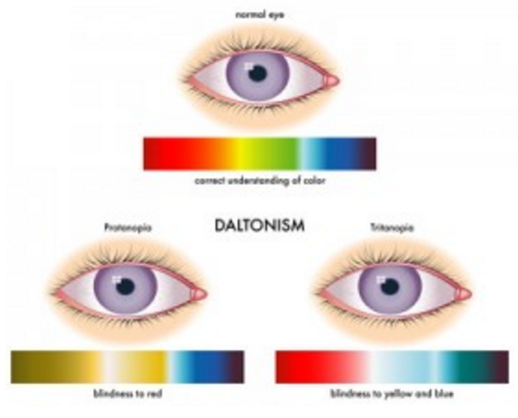
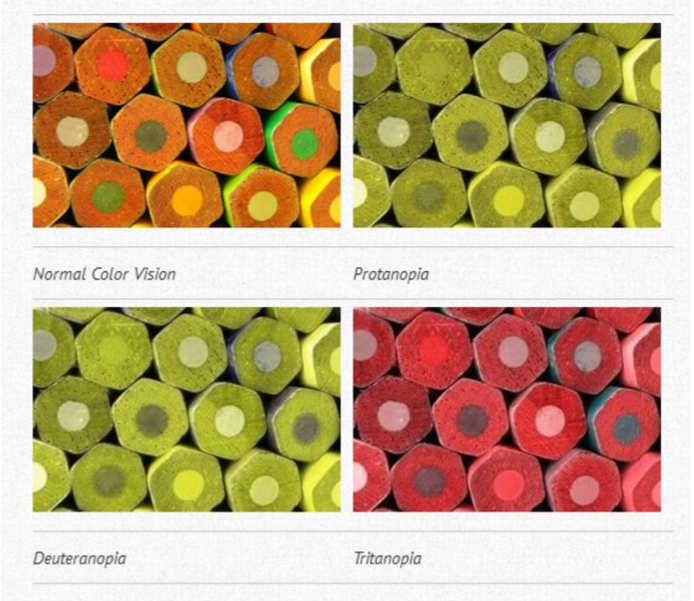
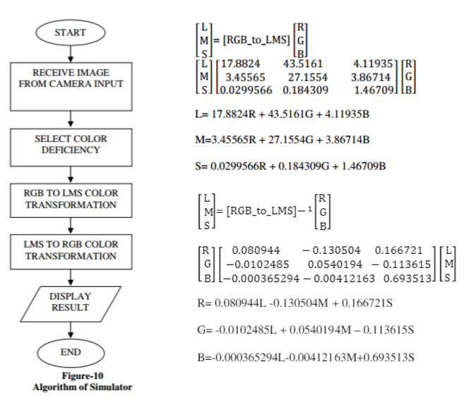
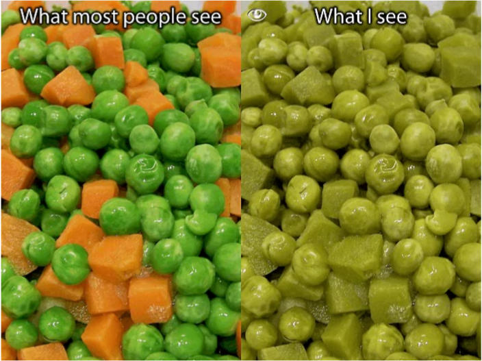

<section id="themes">
	<h2>Themes</h2>
		

			Set your presentation theme:  
			<!-- Hacks to swap themes after the page has loaded. Not flexible and only intended for the reveal.js demo deck. -->
                        <a href="#" onclick="document.getElementById('theme').setAttribute('href','css/theme/black.css'); return false;">Black (default)</a> -
			<a href="#" onclick="document.getElementById('theme').setAttribute('href','css/theme/white.css'); return false;">White</a> -
			<a href="#" onclick="document.getElementById('theme').setAttribute('href','css/theme/league.css'); return false;">League</a> -
			<a href="#" onclick="document.getElementById('theme').setAttribute('href','css/theme/sky.css'); return false;">Sky</a> -
			<a href="#" onclick="document.getElementById('theme').setAttribute('href','css/theme/beige.css'); return false;">Beige</a> -
			<a href="#" onclick="document.getElementById('theme').setAttribute('href','css/theme/simple.css'); return false;">Simple</a>  
			<a href="#" onclick="document.getElementById('theme').setAttribute('href','css/theme/serif.css'); return false;">Serif</a> -
			<a href="#" onclick="document.getElementById('theme').setAttribute('href','css/theme/blood.css'); return false;">Blood</a> -
			<a href="#" onclick="document.getElementById('theme').setAttribute('href','css/theme/night.css'); return false;">Night</a> -
			<a href="#" onclick="document.getElementById('theme').setAttribute('href','css/theme/moon.css'); return false;">Moon</a> -
			<a href="#" onclick="document.getElementById('theme').setAttribute('href','css/theme/solarized.css'); return false;">Solarized</a>
		

</section>

H:

# Proyecto Final

* Andrés Acuña
* Jessica Casas
* Carlos Cogua

H:

## ¿Qué es el daltonismo?

Defecto de la vista que consiste en no distinguir ciertos colores o confundirlos con otros, comúnmente entre verdes y rojos, y ocasionalmente azules.

V:

## ¿Por qué se da esta condición?

Cuando una o más de las células cónicas de color están ausentes, o detectan un color diferente al normal.

Un daltonismo severo ocurre cuando hay una ausencia de los tres conos.
 
Un  daltonismo leve ocurre cuando hay los tres conos están presentes, pero alguna de las células cónicas no funciona normalmente y detecta un color diferente al normal.

V:

## ¿Por qué se da esta condición? (part 2)

* Condición genética. Hombres con mayor probabilidad de sufrirlo. Mujeres principalmente portadoras.
* Puede darse a causa de enfermedades padecidas o como efectos tóxicos de algunos medicamentos. 
* Un daltonismo causado por enfermedades, afecta a los ojos de manera diferente.

V:

## Tipos de daltonismo

Protanopes no ven el color  ROJO

Deuteranopes no ven el color  VERDE

Tritanopes no ven el  AZUL

V:
## Tipos de Daltonismo 

V:
## Tipos de Daltonismo

H:

## An Assistive Model for ICT Applications for Color Blindness

Wafa Qaiser Khan , Reema Qaiser Khan
Computer and Software Engineering Department, Bahria University, Karachi Campus, PAKISTAN 

Muhammad Sarim , Abdul Basit Shaikh and Sheikh Kashif Raffat.
Department of Computer Science, Federal Urdu University of Arts, Sciences and Technology, Karachi, PAKISTAN

V:
## Modelo del Algoritmo de Asistencia 

V:

## Algoritmo del Simulador

V:

## Combinación de Colores

V:

## Ejemplo de uso de una aplicación para personas daltónicas

V:

## Ejemplo 2

H:

## Herramienta Desarrollada
* Processing 3
* Shader por tipo de Daltonismo
* 3 etapas

V:

## Etapas

V:

## 1) Test de Ishihara
* 21 Cartas Identificadoras
* De Control, Propias para cada tipo de Daltonismo

V:

## 2) Analisis de resultados
* Resultados del Test
* Probabilidad de padecer cada enfermedad

V:

## 3) Video
* Carga de shader desarrollado segun el analisis de datos obtenido	

H:

## Resultados

H:

## Referencias

* An Assistive Model for ICT Applications for Color Blindness, Wafa Qaiser Khan, Reema Qaiser Khan, Muhammad Sarim, Abdul Basit Shaikh and Sheikh Kashif Raffa

* [New app lets colour blind people see for the first time - their reactions are amazing](http://www.telegraph.co.uk/technology/news/11882403/New-app-lets-colour-blind-people-see-for-the-first-time-their-reactions-are-amazing.html)

* [¿Qué es el daltonismo?](https://www.aao.org/salud-ocular/enfermedades/daltonismo)

* [El Daltonismo](https://www.uam.es/personal_pdi/medicina/algvilla/fundamentos/nervioso/Daltonismo/daltonismo.html)

* [Why Color Blindness is No Longer a Problem for Web Design](https://www.templatemonster.com/blog/designing-colorblind-friendly-website/)

