<section id="themes">
	<h2>Themes</h2>
		

			Set your presentation theme:  
			<!-- Hacks to swap themes after the page has loaded. Not flexible and only intended for the reveal.js demo deck. -->
                        <a href="#" onclick="document.getElementById('theme').setAttribute('href','css/theme/black.css'); return false;">Black (default)</a> -
			<a href="#" onclick="document.getElementById('theme').setAttribute('href','css/theme/white.css'); return false;">White</a> -
			<a href="#" onclick="document.getElementById('theme').setAttribute('href','css/theme/league.css'); return false;">League</a> -
			<a href="#" onclick="document.getElementById('theme').setAttribute('href','css/theme/sky.css'); return false;">Sky</a> -
			<a href="#" onclick="document.getElementById('theme').setAttribute('href','css/theme/beige.css'); return false;">Beige</a> -
			<a href="#" onclick="document.getElementById('theme').setAttribute('href','css/theme/simple.css'); return false;">Simple</a>  
			<a href="#" onclick="document.getElementById('theme').setAttribute('href','css/theme/serif.css'); return false;">Serif</a> -
			<a href="#" onclick="document.getElementById('theme').setAttribute('href','css/theme/blood.css'); return false;">Blood</a> -
			<a href="#" onclick="document.getElementById('theme').setAttribute('href','css/theme/night.css'); return false;">Night</a> -
			<a href="#" onclick="document.getElementById('theme').setAttribute('href','css/theme/moon.css'); return false;">Moon</a> -
			<a href="#" onclick="document.getElementById('theme').setAttribute('href','css/theme/solarized.css'); return false;">Solarized</a>
		

</section>

H:

# Transformations

Carlos Andres Cogua Ariza

H:

## Index

 1. Goal<!-- .element: class="fragment" data-fragment-index="1"-->
 2. Design<!-- .element: class="fragment" data-fragment-index="2"-->
 3. Interaction<!-- .element: class="fragment" data-fragment-index="3"-->
 4. Demo<!-- .element: class="fragment" data-fragment-index="4"-->
 5. Conclusions<!-- .element: class="fragment" data-fragment-index="5"-->
 6. Questions<!-- .element: class="fragment" data-fragment-index="6"-->

H:

## Goal

* 3D robot character with basic functions
* Learn how to use transformations in 3D space

H:

## Design

* Scene Graph
* Default Shader

V:

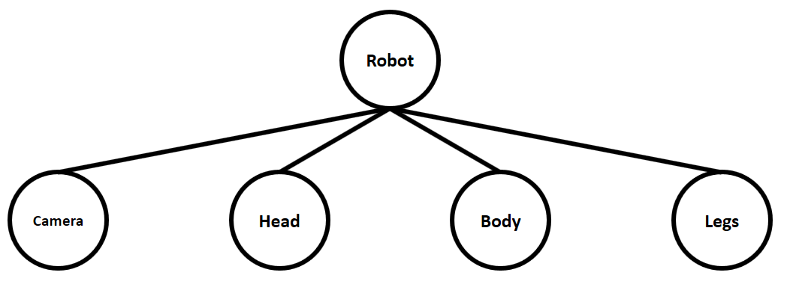

V:

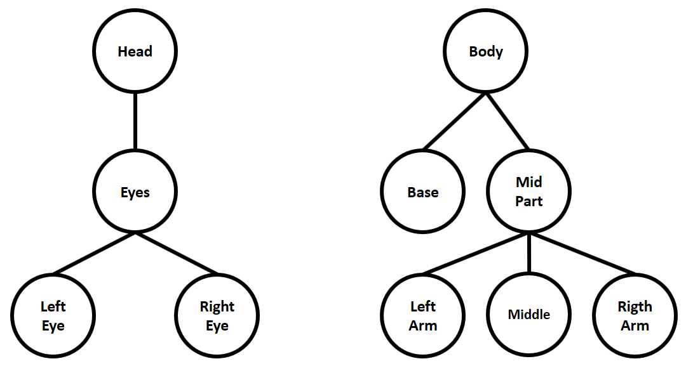

V:

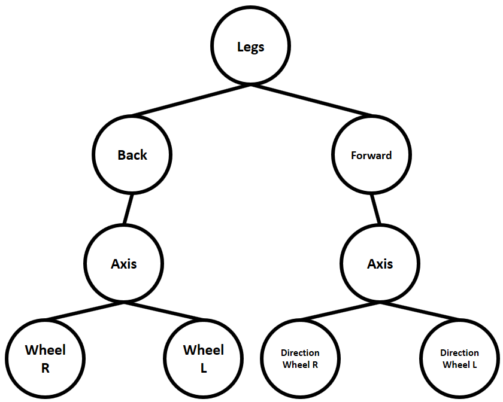

H:

## Interaction

User Interaction

1. Mouse
2. Keyboard

V:

## Mouse

V:

## Mouse dragger

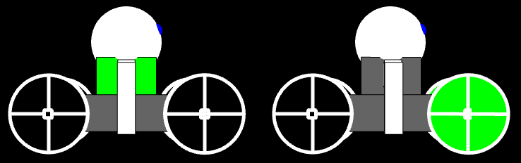

V:

## KeyBoard

V:

## Mouse move (C)

Enable/Disable Camera, mouse's move in X axis

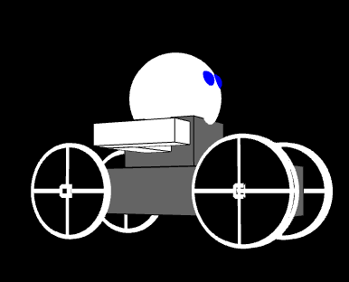

V:

## Horizontal Camera (A,D)

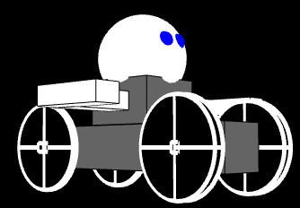

V:

## Vertical Camera (W,S)

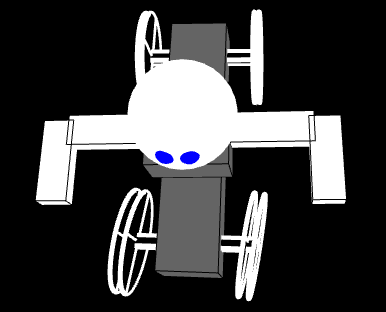

V:

## Move (UP, DOWN)

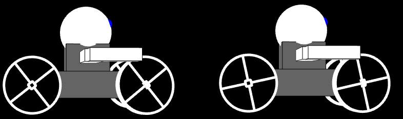

V:

## Head (LEFT, RIGHT)

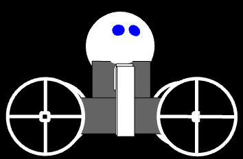

V:

## Left Arm (Q)

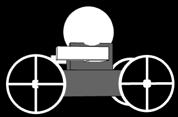

V:

## Right Arm (E)

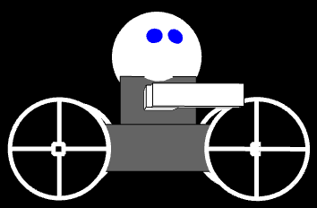

H:

## Demo

Run the demo from [here](https://youtu.be/t2fS_j0SiHk)

H:

## Conclusions

1. Results
2. Future work

V:

## Results 

*  The robot's react correctly but have limitations, like mouse's click in 3D space
*  A good and simple hierarchy is easy to create in processing

V:

## Future work

*  Correct the movement in the middle, with mouse click
*  Add more joint points
*  Create a world to test the robot's interactions

H:

## Questions

?

H:

## References

* [Math primer for graphics and game development](https://tfetimes.com/wp-content/uploads/2015/04/F.Dunn-I.Parberry-3D-Math-Primer-for-Graphics-and-Game-Development.pdf)
* [Proccesing's Examples](https://processing.org/examples/)
